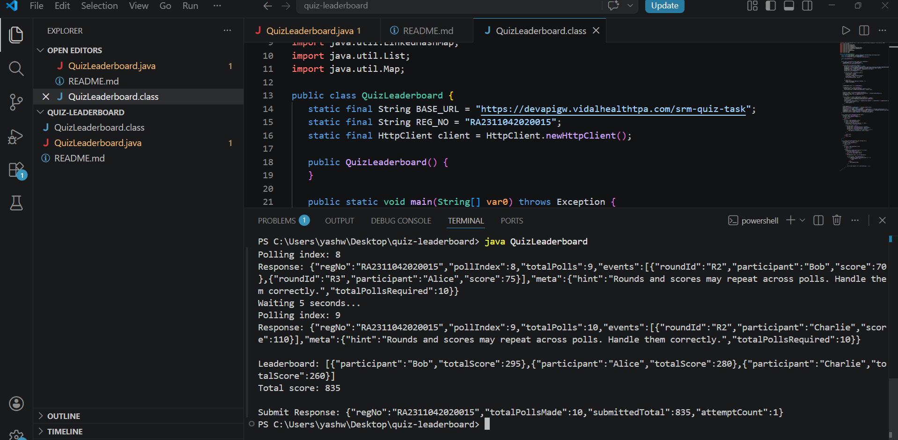

# Quiz Leaderboard System

Internship assignment from Bajaj Finserv Health built for the SRM qualifier round.

## What the problem asked

Poll a quiz API 10 times, collect score events for participants across rounds, and submit a final leaderboard. The catch — the API intentionally sends duplicate events across polls. If you don't handle that, your total score will be wrong.

## How I solved it

The entire solution is in a single Java file with no external dependencies.

**Deduplication** was the core challenge. I used a composite key `roundId|participant` and `putIfAbsent` on a HashMap — so if the same round+participant combo shows up again in a later poll, it just gets ignored. First occurrence wins.

**Polling**: 10 GET requests, poll 0 through 9, with a 5 second wait between each one as required.

**Aggregation**: after deduplication, scores are summed per participant across all unique rounds.

**Submission**: sorted by total score descending, posted once.

## Running it

You need Java 11 or above.

```bash
javac QuizLeaderboard.java
java QuizLeaderboard
```

Takes about 50 seconds to finish because of the mandatory delays between polls.

## Output I got

```
Leaderboard: [{"participant":"Bob","totalScore":295},{"participant":"Alice","totalScore":280},{"participant":"Charlie","totalScore":260}]
Total score: 835
Submit Response: {"submittedTotal":835,"attemptCount":1}
```


## Stack

Just Java. No Maven, no Gradle, no JSON libraries. Built-in `java.net.http.HttpClient` for requests and manual JSON parsing to keep it dependency-free.

